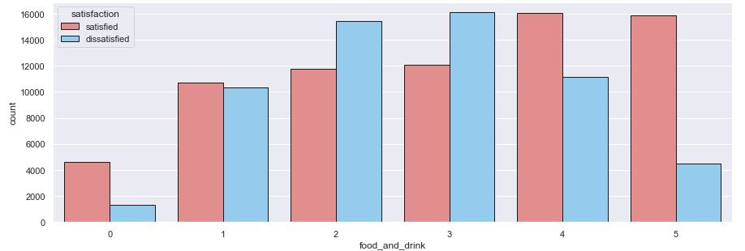

   

# Airline-Customer-Satisfaction

Análise de Satisfação dos Passageiros.

  

## Conteúdo

<!--ts-->

1.  [Problema](#Contexto-do-Problema)
2.  [Entendimento do Problema](#Entendimento-do-Problema)
3.  [Dados](#Descricao-dos-Dados)
4.  [Planejamento da Solução](#Planejamento-da-Solução)
5.  [Hipóteses Principais](#Hipoteses-Principais)
6.  [Resultado](#Resultado)
7.  [Entrega da Solução](#Entrega-da-Solucao)
<!--te-->

# Contexto do Problema

A **Airline** é uma companhia aérea que tem como modelo de negócio vender passagens aéreas e levar pessoas até o destino de suas viagens e seu diferencial competitivo é o preço baixo em comparação com o mercado. Em uma reunião, os diretores notaram que os preços da concorrência estavam igualando ao da Airline, e agora a missão é se diferenciar com experiência do cliente.

Como resultado, foi identificado que 45% dos passageiros são insatisfeitos e o objetivo é diminuir a taxa de insatisfação. Eles decidiram que precisam melhorar/mudar seus serviços e, para isso, querem uma análise para identificar as causas das insatisfações e o que deverá ser melhorarado ou mudado.

Satisfação dos passageiros da Airline:

  

# Entendimento do Problema

#### **Motivação:**

- Conseguir manter um diferencial competitivo em comparação com outras companhias aéreas.

#### **Causa Raiz do Problema:**

- Alta taxa de passageiros insatisfeitos.

#### **Entrega da Solução:**

- Lista dos 5 serviços que mais causam insatisfação.
- Sugestões de quais serviços devem ser melhorados.
- Dashboard para acompanhamento da satisfação.

#### **Dados para Resolver o Problema:**

- Os dados estão no Kaggle e podem ser encontrados [aqui](https://www.kaggle.com/teejmahal20/airline-passenger-satisfaction).

# Descrição dos Dados

O Dataset usado para este projeto possui 129880 linhas e 23 colunas. Os dados contém:

| Atributo                          | Significado                                                           |
| --------------------------------- | --------------------------------------------------------------------- |
| Gender                            | Sexo do passageiro (Female, Male)                                     |
| Customer Type                     | O tipo do cliente (Loyal customer, disloyal customer)                 |
| Age                               | Idade atual do passageiro                                             |
| Type of Travel                    | Propósito de vôo do passageiro (Personal Travel, Business Travel)     |
| Class                             | Classe do passageiro no avião (Business, Eco, Eco Plus)               |
| Flight distance                   | Distância em que o vôo terá                                           |
| flight wifi service               | Nivel de satisfação do Wifi (0:Not Applicable;1-5)                    |
| Departure/Arrival time convenient | Nivel de satisfação da hora partida/chegada conveniente               |
| Ease of Online booking            | Nivel de satisfação na reserva online                                 |
| Gate location                     | Nivel de satisfação da distancia do portão de embarque                |
| Food and drink                    | Nivel de satisfação da comida/bêbida                                  |
| Online boarding                   | Nivel satisfação do embarque online                                   |
| Seat comfort                      | Nivel satisfação do comforto da poltrona                              |
| Inflight entertainment            | Nivel de satisfação do entretenimento no Võo                          |
| On-board service                  | Nivel de satisfação do serviço de On-board                            |
| Leg room service                  | Nivel de satisfação do serviço de quarto para pernas                  |
| Baggage handling                  | Nivel de satisfação do manuseio das bagagens                          |
| Check-in service                  | Nivel de satisfação do serviço de checkin                             |
| Cleanliness                       | Nivel de satisfação da limpeza                                        |
| Departure Delay in Minutes        | Atraso em minutos na partida                                          |
| Arrival Delay in Minutes          | Atraso em minutos na chegada                                          |
| Satisfaction                      | Satisfação com a companhia aérea level(Satisfaction, dissatisfaction) |

# Planejamento da Solução

**1. Coletar os dados:**

- Carregar o conjunto de dados que será utlizado.

**2. Limpar os dados:**

- Entender as variáveis disponíveis
- Verificar possíveis valores faltantes e inconsistências.

**3. Entender os dados:**

- Realizar uma estatística descritiva para entender as características dos dados.

**4. Levantar Hipóteses:**

- Criar Hipóteses sobre as características e o comportamento da satisfação dos passageiros.

**5. Realizar Análise Exploratória de Dados:**

- Validar ou refutar as hipóteses através dos dados.
- Identificar correlação entre variáveis e a variável de satisfação.
- Obter insights.

**6. Escrever os Insights encontrados:**

- Demonstração das descobertas.

**7. Escrever possíveis soluções para o problema da Airline:**

- Dashboard de acompanhamento e melhorias a serem feitas.

# Hipóteses Principais

### H1. Passageiros com idade menor que 30 anos possuem maior satisfação.

**FALSA** Passageiros com idade MAIOR que 30 anos possuem MAIOR satisfação.

  

### H3. Passageiros da classe Business possuem maior satisfação.

**VERDADEIRA** Passageiros da classe Business possuem MAIOR satisfação.

  

### H8. Quanto maior a nota de entretenimento no vôo, menor é a insatisfação.

**VERDADEIRA** Quando a nota do entretenimento nos vôo chega em 4 ou 5, menor é a insatisfação em realação a satisfação.

  

### H11. Quanto maior a nota da comida e bebida no vôo, menor é a insatisfação.

**VERDADEIRA** Quanto maior a nota da comida e bebida no vôo, menor é a insatisfação.

  

# Resultado

## Perfil de passageiros insatisfeitos.

- **Classe:** Eco.

- **Viagens:** Pessoais e de Negócios.

- **Idade:** Passageiros com idade maior que 30 anos.

- **Sexo:** Maior parte masculinos.

- **Tipo:** Clientes fiéis.

## Lista dos 5 serviços que mais causam insatisfação.

- Conforto da poltrona.
- Comida e bebida.
- Localização do portão.
- Previsão de chegada/partida do avião.
- Serviço WIFI

## Sugestões de melhorias.

Levando em consideração melhorias que será necessário baixo investimento e que ainda levará a um aumento de 15% na satisfação:

**Melhorias a serem feitas**:

- Comida e Bebida.
- Tempo de previsão chegada/saída do avião.
- Embarque online dos passageiros.
- Entretenimento no vôo.

## Retorno.

Satisfação esperada após a Airline realizar as melhorias:

  

# Entrega da Solução

Dashboard para acompanhamento da satisfação dos passageiros com obetivo de garatir que as melhorias feitas estará gerando bons resultados.

O Dashboard pode ser acessado [aqui](https://app.powerbi.com/view?r=eyJrIjoiYmZjMTMyZTgtMzI1Ni00N2FlLThjZGQtNTU2Y2VkMzhhMWJjIiwidCI6ImE2NWZjMjIxLWZhOGMtNGI0Yy1iMjJiLTJjYzExOGMyNTMxZiJ9&pageName=ReportSection77b4f8a7555d7590089a).

  

