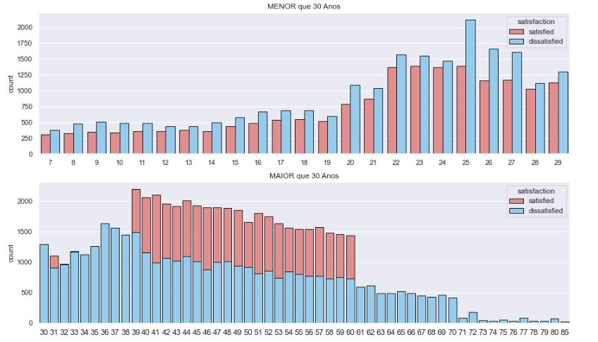

# Airline-Customer-Satisfaction

Análise da Satisfação dos Passageiros.

  

# Contexto do Problema

A muito tempo atrás, a companhia aérea, chamada Arline, era criada e fundada através da paixão de dois empreendedores por aviões. O maior objetivo, era entregar vôos que ficassem na memória dos clientes devido a alta qualidade. Depois de um tempo, os donos tiveram problemas com o conselho administrativo e foi decidio que ambos deixariam de atuar como CEO e estar a frente de toda operação. Depois de 2 anos, os donos voltam como CEOs, na expectativa de transformar a companhia aérea e trazer de volta os valores da alta qualidade e experiência dada aos clientes em seus vôos. 

O mercado de companhias aéreas é muito competitvo, pois normalmente o grande influenciador na hora da compra é o preço. Geralmente, isso define em qual companhia aérea o cliente optará. Contudo, após a compra, o que influencia se irá retornar a voar novamente na companhia é a experiencia que o cliente terá.

Pensando nisso, os CEOs e diretores, sentaram para discutir a respeito do grande numero de clientes insastifeitos em seus vôos. Eles decidiram que precisam melhorar/mudar seus serviços. Para isso, querem uma análise para identificar as causas das insatisfações e o que deverá ser melhorarado ou mudado.

  

# Entendimento do Problema

### Motivação:
    - Melhorar a experiência dos passageiros.
     
### Causa Raiz do problema:
    Identificar o que deve ser melhorado visando garantir diminuir a insatisfação dos passageiros.

### Formato da Entrega:
    Arquivo Excel com os resultados da análise.
    
### Dados para Resolver o Problema
    Link: https://www.kaggle.com/teejmahal20/airline-passenger-satisfaction
    

# Descrição dos Dados

O Dataset usado para este projeto está no Kaggle. Ele contém 129880 linhas e 23 colunas. Os dados contém:

Gender: Sexo do passageiro (Female, Male)

Customer Type: O tipo do cliente (Loyal customer, disloyal customer)

Age: Idade atual do passageiro

Type of Travel: Propósito de vôo do passageiro (Personal Travel, Business Travel)

Class: Classe do passageiro no avião (Business, Eco, Eco Plus)

Flight distance: Distância em que o vôo terá

Inflight wifi service: Nivel de satisfação do Wifi (0:Not Applicable;1-5)

Departure/Arrival time convenient: Nivel de satisfação da hora partida/chegada conveniente

Ease of Online booking: Nivel de satisfação na reserva online

Gate location: Nivel de satisfação da distancia do portão de embarque

Food and drink: Nivel de satisfação da comida/bêbida

Online boarding: Nivel de satisfação do embarque online

Seat comfort: Nivel de satisfação do comforto da poltrona

Inflight entertainment: Nivel de satisfação do entretenimento no Võo

On-board service: Nivel de satisfação do serviço de On-board

Leg room service: Nivel de satisfação do serviço de quarto para pernas

Baggage handling: Nivel de satisfação do manuseio das bagagens

Check-in service: Nivel de satisfação do serviço de checkin

Cleanliness: Nivel de satisfação da limpeza

Departure Delay in Minutes: Atraso em minutos na partida 

Arrival Delay in Minutes: Atraso em minutos na chegada

Satisfaction: Satisfação com a companhia aérea level(Satisfaction, dissatisfaction)

# Feature Engineering

As colunas com niveis de satisfação entre 1 e 5 foram alteradas para variaveis categóricas. Sendo 1 e 2 = Ruim, 3 = Mediano, 4 e 5 = Bom. 0 = Não possui. Foi criada a coluna **type_flight** a partir da distancia do vôo, onde vôos maiores que a distância média são considerados viagem longa e abaixo da média como viagem curta. E, ainda, a partir dos dois tipos de atrasos, partida e chegada, foram criada as colunas: **type_departure_delay** e **type_arrival_delay**, possuindo a categória do atraso (curto, longo).

# Hipóteses Principais

### H1. Passageiros com idade menor que 30 anos possuem maior satisfação.

**FALSA** Passageiros com idade MAIOR que 30 anos possuem MAIOR satisfação.

  

### H20. Entre todos os serviços, o entretenimento do vôo é o pior.

**FALSA** Entre todos os serviços, o conforto da poltrona é o PIOR.

  

### H21. Passageiros da classe Eco possuem maior problema com os serviços

**VERDADEIRA** Passageiros da classe Eco possuem maior problema/insatisfação em 9 de 14 serviços.

  

# Resultado

Melhorias a serem feitas:

**Melhorias classe Eco:** 

- Conforto da poltrona
- Comida/bêbida
- Previsão horário de chegada/partida conveniente
- Entretenimento.

**Melhorias classe Business:** 

- Conforto da proltrona
- Comida/bêbida
- Previsão horário de chegada/partida conveniente
- Localização do portão de embarque.

**Retorno ao negócio**

Uma pesquisa realizada nos EUA comprova que são necessárias 12 novas experiências positivas para reparar o(s) dano(s) causado(s) por uma experiência negativa e segundo a Airbus, um avião comercial consome, em média, 12 litros a cada quilômetro.

Com base nisso, colocando o preço do litro como 3,50 de reais e a média de distância de vôo da Airline sendo 1981km. Gastaria em cerca de 83.202 de reais somente de gasolina para 1 vôo. Para cada cliente insatisfeito é necessário 12 novos Vôos para reparar, equivalendo à R$998.424.

Com as mudanças, é esperado que a satisfação dos passageiros aumente em 15%, aumentando o atual percentual de 54% para 69% de satisfação. A airline gastará 83.202 de reais (1 vôo) para atribuir uma boa experiência, ao invés de 998.424 reais (12 vôos), economizando então, 914.616 em reais para fidelizar um cliente.

  

# Entrega da Solução

  

